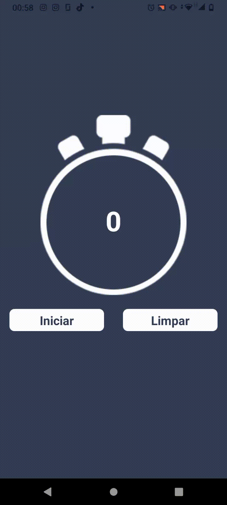

# Cronômetro React Native

# 

Esse projeto é um cronômetro desenvolvido em React Native, que permite ao usuário iniciar e parar a contagem do tempo, além de limpar e ver o último tempo registrado.

## **Funcionamento**

O cronômetro funciona através de um contador, implementado com o uso de hooks do React. Quando o usuário clica em "Iniciar", o contador começa a contar o tempo em segundos, minutos e horas. O tempo é exibido em tempo real na tela, com a formatação adequada. Quando o usuário clica em "Parar", o contador é pausado e o tempo atual é mantido na tela. O usuário pode clicar em "Limpar" para zerar o contador e começar uma nova contagem. O último tempo registrado é exibido na tela.

## **Tecnologias**

As tecnologias utilizadas nesse projeto foram:

- React Native
- Expo
- JavaScript

## **Como rodar o projeto**

Para rodar o projeto localmente, é necessário ter o ambiente de desenvolvimento do React Native configurado em seu computador. Em seguida, basta clonar o repositório, abrir o terminal na pasta do projeto e executar os seguintes comandos:

```

npm install

```

```

expo start

```

O projeto será aberto em seu navegador padrão, e você poderá escolher rodar o aplicativo em seu próprio dispositivo móvel (utilizando o aplicativo Expo Go) ou em um emulador de sua escolha.

## 
## **Neste código foram utilizados os seguintes conceitos do React Native:**

1. Componentes: a interface do aplicativo é construída usando componentes fornecidos pelo React Native, como View, Text, TouchableOpacity, Image e StatusBar.
2. Props: propriedades são passadas para os componentes para personalizar sua aparência ou comportamento, como style, onPress, source, style, auto, entre outras.
3. Estado: a função useState é usada para criar variáveis ​​de estado que podem ser modificadas e monitoradas pelo React. No código, numero, botao e ultimo são variáveis ​​de estado usadas para controlar o tempo do cronômetro, os botões de controle e o registro do tempo anterior, respectivamente.
5. Eventos: os eventos são usados ​​para desencadear ações no aplicativo, como iniciar ou parar o cronômetro. No código, os eventos onPress são usados ​​para detectar quando o usuário pressiona os botões de controle.
6. Estilos: o estilo dos componentes é definido usando a propriedade style, que aceita um objeto que especifica as regras de estilo. No código, a função StyleSheet.create é usada para criar objetos de estilo reutilizáveis.

## **Amostra**



## **Autor**

<a href="https://github.com/Francielefernandes06">
 
 <br />
 <sub><b>Franciele Fernandes</b></sub></a> <a href="https://github.com/Francielefernandes06" title="GitHub">☕</a>


Feito com ❤️ por Franciele Fernandes 👋🏽 Entre em contato!

<a href="https://instagram.com/franciele_fernandes06" target="_blank"></a>
<a href = "mailto:francielefernandes126@gmail.com"></a>
 <a href="https://www.linkedin.com/in/franciele-fernandes-92556b1a7/" target="_blank"></a> 
 <a href="https://wa.me/5584994285704?text=Olá,%20Franciele%20Fernandes.%20Tudo%20bem?" target="_blank"></a>


## **Licença**

Esse projeto está licenciado sob a licença MIT. Veja o arquivo LICENSE para mais detalhes.